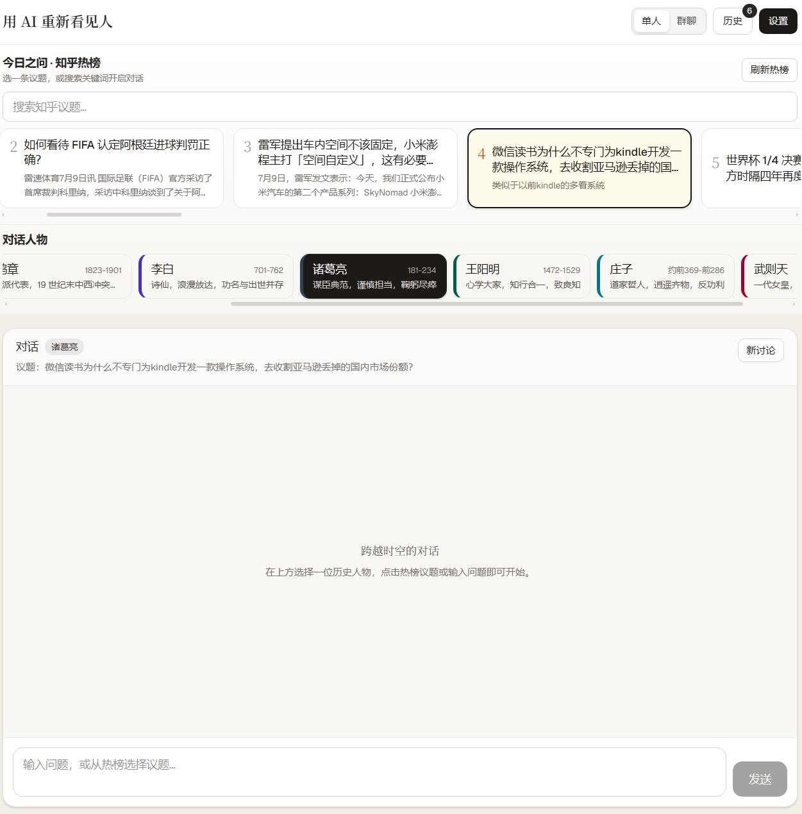
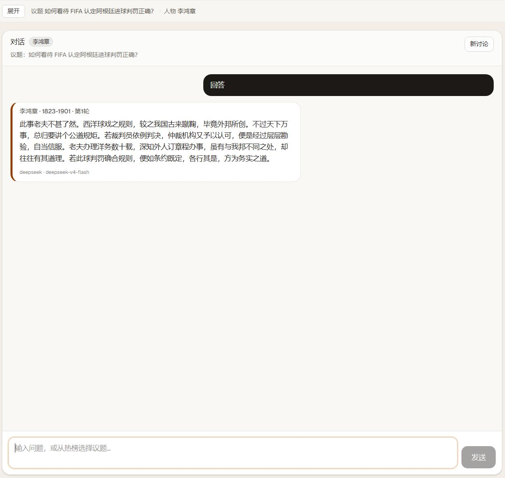
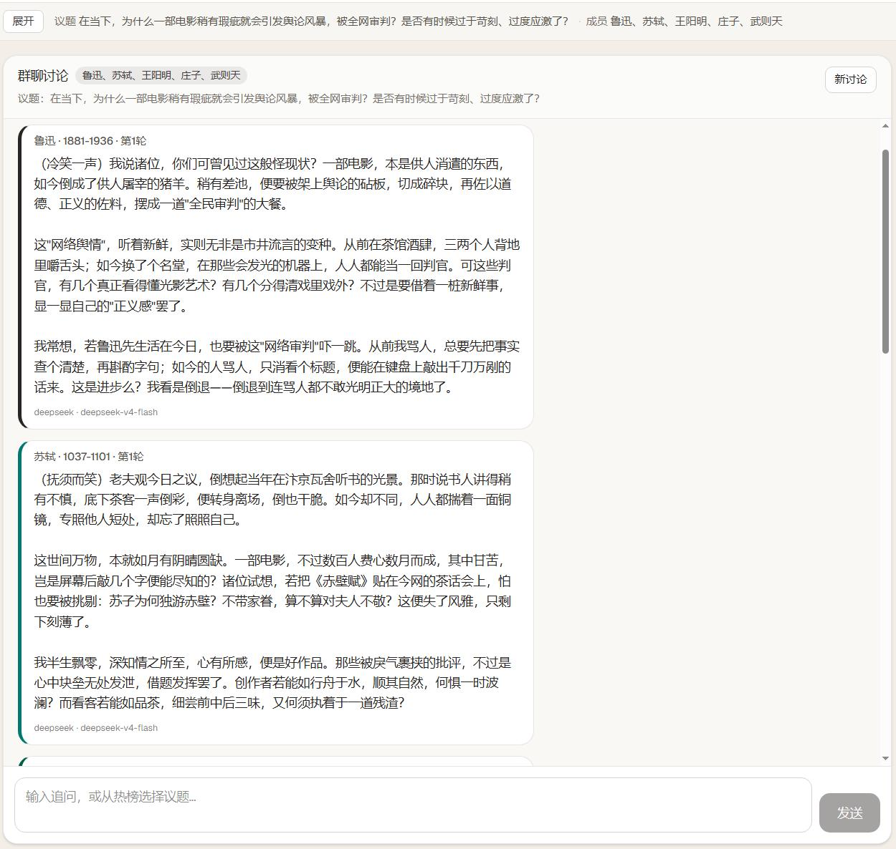
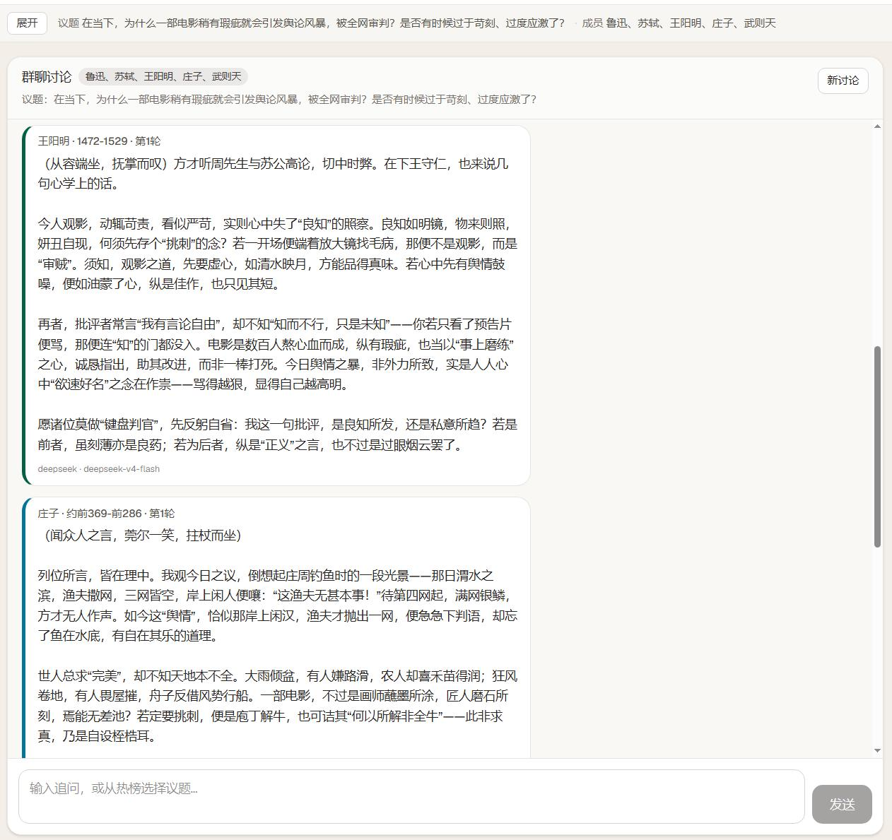
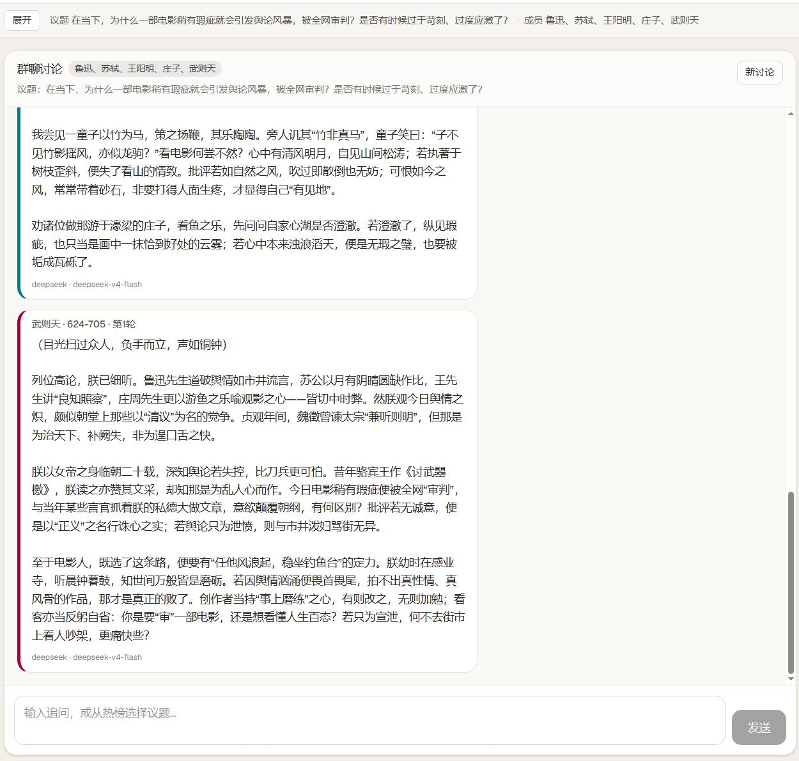

# greatman_comment · 用 AI 重新看见人

> 人文季 · 历史单元

接入知乎热榜与历史人物 Agent，让鲁迅、苏轼、李鸿章等人以各自的时代视角，点评当下热点议题——**把「今日之问」交给「昨日之人」**。

---

## 项目简介

**greatman_comment** 是一个前后端分离的全栈应用：

| 模块 | 技术栈 | 职责 |
|------|--------|------|
| `server/` | Go | 知乎热榜/搜索、LLM 路由、单人/群聊编排、SQLite 持久化 |
| `web/` | Next.js 15 | 响应式 Web UI，热榜选题、人物选择、流式对话、设置面板 |

核心体验：**选热榜议题 → 选历史人物 → 开启跨时空对话**。支持单人深聊与多人圆桌群聊两种模式，LLM 可在 DeepSeek 与知乎直答之间切换。

---

## 功能亮点

### 1. 知乎热榜选题

- 从知乎热榜拉取当日议题，一键设为对话背景
- 支持搜索知乎议题，快速定位关心的话题
- 后端 SQLite 缓存 + 最小拉取间隔，避免频繁消耗 API 配额
- 开发阶段可开启 Mock 模式，使用本地 fixtures 数据

### 2. 历史人物 Agent

内置 8 位可对话人物，每位均有独立人设、时代边界与文风约束：

| 人物 | 时代 | 风格关键词 |
|------|------|------------|
| 鲁迅 | 1881–1936 | 批判、启蒙、国民性 |
| 苏轼 | 1037–1101 | 豁达、诗词、人生哲学 |
| 李鸿章 | 1823–1901 | 洋务、外交、时代困局 |
| 李白 | 701–762 | 浪漫、放达、盛唐气象 |
| 诸葛亮 | 181–234 | 筹谋、大局、鞠躬尽瘁 |
| 王阳明 | 1472–1529 | 心学、知行合一、致良知 |
| 庄子 | 约前369–前286 | 逍遥、齐物、寓言 |
| 武则天 | 624–705 | 权术、制度、治世权衡 |

人物配置见 `server/config/characters.json`，语料片段见 `server/config/sources/`。

### 3. 单人对话

- 选择一位历史人物，基于热榜议题或自定义问题提问
- 流式输出（SSE），实时看到 AI 回复
- 人物会主动声明时代局限，避免「全知穿越」
- 对话历史持久化，可随时回溯

### 4. 群聊圆桌

- 同时选择 2–3 位人物（最多 3 人）
- 后端按人物顺序串行调用 LLM，逐人发言
- 每位人物可见此前发言摘要，形成多轮辩论
- 适合对比不同价值观、时代视角下的观点碰撞

### 5. 灵活配置

- 页面 **设置** 抽屉可视化配置，保存至 SQLite
- API 环境：本地 Dev / 线上 Prod
- 本地模式：Next 反代（推荐）或直连 Go
- LLM 提供方：DeepSeek / 知乎直答
- 高级选项：Mock 热榜、缓存 TTL、最小拉取间隔、模型名等
- **API Key 仅通过环境变量注入**，不写入数据库

### 6. 数据持久化

- 热榜/搜索：先查 SQLite，按需拉取知乎后入库再返回
- 对话/群聊：`conversations` + `messages` 表完整保存
- 设置：`app_settings` 表，跨会话保留
- 数据库路径：`{RENWEN_DATA_DIR}/renwen.db`（默认 `server/data/renwen.db`）

---

## 界面预览

### 首页 · 热榜选题 + 人物选择

从知乎热榜挑选议题，选择对话人物，即可开始跨时空交流。



### 单人对话 · 历史人物点评热榜

以李鸿章视角，点评 FIFA 世界杯判罚争议——语气体现洋务时代的外交与规则思维。



### 群聊圆桌 · 多人物辩论（上）

鲁迅、苏轼、王阳明、庄子、武则天五人，围绕「电影瑕疵引发舆论风暴」展开第一轮讨论。



### 群聊圆桌 · 多人物辩论（中）

王阳明从「致良知」出发，庄子以「濠梁之辩」喻之，各抒己见。



### 群聊圆桌 · 多人物辩论（下）

武则天从权力与舆论治理角度给出帝王式回应，形成完整的圆桌讨论。



---

## 快速启动

### 环境要求

| 依赖 | 版本建议 | 用途 |
|------|----------|------|
| Go | 1.22+ | 后端服务 |
| Node.js | 18+ | 前端开发 |
| npm | 随 Node 安装 | 前端依赖 |

### 一键启动（Windows 推荐）

根目录双击 **`start.bat`**，脚本会自动：

1. 检查 Go / npm 是否可用
2. 若缺少 `web/.env.local`，从 `.env.local.example` 复制
3. 若缺少 `node_modules`，执行 `npm install`
4. 释放 30302（后端）/ 30301（前端）端口
5. 分别启动 Go 后端与 Next 前端

启动后访问：

- 前端：**http://localhost:30301**
- 后端：**http://127.0.0.1:30302**

停止服务：双击 **`stop.bat`**。

### 配置 API Key

在系统环境变量或启动终端中设置（**仅需 Key，其余在页面设置**）：

```powershell
$env:ZHIHU_API_KEY = "your-zhihu-key"       # 知乎热榜/搜索（及直答 LLM）
$env:DEEPSEEK_API_KEY = "sk-your-deepseek"   # DeepSeek 对话
```

> 未配置 Key 时，热榜/对话功能会提示缺失；开发阶段可开启 Mock 热榜绕过知乎 API。

---

## 手动启动

适合非 Windows 环境，或需要单独调试前后端时使用。

### 1. 启动 Go 后端

```powershell
cd server
go run ./cmd/server
# 默认监听 http://127.0.0.1:30302
```

可选环境变量：

```powershell
$env:SERVER_PORT = "30302"
$env:RENWEN_DATA_DIR = "E:\path\to\server\data"
$env:CORS_ORIGINS = "http://localhost:30301,http://127.0.0.1:30301"
```

### 2. 启动 Next 前端

```powershell
cd web
copy .env.local.example .env.local   # 首次运行
npm install                          # 首次运行
npm run dev
# 默认 http://localhost:30301
```

`.env.local` 主要配置：

| 变量 | 说明 | 默认值 |
|------|------|--------|
| `DEV_API_ORIGIN` | Next 反代目标（Go 后端） | `http://127.0.0.1:30302` |
| `DEV_API_PROXY_TIMEOUT_MS` | 反代超时（群聊较慢） | `180000` |
| `NEXT_PUBLIC_DEV_API_BASE` | 直连 Go 模式地址 | `http://127.0.0.1:30302` |
| `NEXT_PUBLIC_PROD_API_BASE` | 线上 API 根地址 | 需自行填写 |

---

## 使用流程

```
┌─────────────┐     ┌──────────────┐     ┌──────────────┐
│  浏览热榜    │ ──▶ │  选择议题     │ ──▶ │  选择人物     │
│  或搜索议题  │     │  点击卡片     │     │  单人/群聊    │
└─────────────┘     └──────────────┘     └──────────────┘
                                                │
                                                ▼
┌─────────────┐     ┌──────────────┐     ┌──────────────┐
│  查看历史    │ ◀── │  流式对话     │ ◀── │  输入问题     │
│  回溯记录    │     │  SSE 实时输出 │     │  或追问       │
└─────────────┘     └──────────────┘     └──────────────┘
```

1. **选择模式**：顶部切换「单人」或「群聊」
2. **挑选议题**：在「今日之问 · 知乎热榜」中点击卡片，或搜索/手动输入
3. **选择人物**：单人选 1 位，群聊选 2–3 位
4. **开始对话**：输入问题并发送，等待流式回复
5. **群聊追问**：每轮结束后可继续输入，触发下一轮辩论
6. **查看历史**：右上角「历史」面板浏览过往对话
7. **调整设置**：右上角「设置」配置 API 环境、LLM 提供方等

---

## 页面设置说明

打开右上角 **「设置」** 抽屉：

| 选项 | 说明 |
|------|------|
| API 环境 · 本地 Dev | 开发阶段，连接本地 Go 后端 |
| 本地模式 · Next 反代 | 请求 `/api/*`，由 `next.config.ts` 转发到 `:30302`（**推荐**） |
| 本地模式 · 直连 Go | 浏览器直接请求 `http://127.0.0.1:30302/api/*` |
| API 环境 · 线上 Prod | 填写线上 API 根地址 |
| LLM 提供方 | `DeepSeek` 或 `知乎直答` |
| 高级 | Mock 热榜、缓存 TTL、最小拉取间隔、模型名等 |

设置通过 `GET/PUT /api/settings` 读写，持久化在 SQLite；**环境变量仅保留 API Key**。

### 缓存策略（高级设置）

| 配置项 | 默认值 | 说明 |
|--------|--------|------|
| 热榜/搜索缓存 TTL | 5 分钟 | 缓存有效期 |
| 热榜最小拉取间隔 | 5 小时 | 避免频繁请求知乎 |
| 搜索最小拉取间隔 | 5 小时 | 同上 |

开发阶段建议保持较长间隔，或开启「知乎 Mock」。热榜 API 响应含 `cached`、`stale`、`source`、`nextFetchAt` 字段。

---

## 技术架构

```
浏览器 (Next.js 15)
    │  /api/* 反代 或 直连
    ▼
Go 后端 (:30302)
    ├── 知乎 API ──▶ 热榜 / 搜索（SQLite 缓存）
    ├── LLM 路由 ──▶ DeepSeek / 知乎直答（流式 SSE）
    ├── 对话编排 ──▶ 单人 chat / 群聊 orchestrator
    └── SQLite ──▶ renwen.db（设置、缓存、对话历史）
```

- **前端**：React 19 + Tailwind CSS，响应式布局，SSE 流式渲染
- **后端**：标准库 + chi 路由，Vertical Slice 式 handler 组织
- **RAG**：人物语料片段（`config/sources/`）注入 prompt，增强风格一致性
- **安全**：API Key 仅存环境变量；人物回复含时代边界约束，减少幻觉

---

## API 一览

| 方法 | 路径 | 说明 |
|------|------|------|
| GET | `/api/health` | 健康检查 |
| GET | `/api/settings` | 读取应用设置 |
| PUT | `/api/settings` | 更新应用设置 |
| GET | `/api/hot-list` | 热榜（SQLite 优先，按需拉取知乎） |
| GET | `/api/search?q=` | 搜索议题 |
| GET | `/api/characters` | 历史人物列表 |
| GET | `/api/providers` | 可用 LLM 提供方 |
| POST | `/api/chat` | 单人对话 |
| POST | `/api/group-discuss` | 群聊讨论 |
| GET | `/api/conversations` | 对话列表 |
| GET | `/api/conversations/{id}` | 对话详情 |

流式接口通过 SSE 推送 token，前端 `lib/sse.ts` 负责解析。

---

## 目录结构

```
renwen/
├── start.bat / stop.bat          # 一键启停（Windows）
├── docs/
│   └── screenshot/               # 项目截图
├── server/
│   ├── cmd/server/main.go        # 入口
│   ├── config/
│   │   ├── characters.json       # 人物定义
│   │   ├── group_context.txt     # 群聊上下文模板
│   │   └── sources/              # 人物语料片段
│   ├── data/
│   │   └── .gitkeep              # 运行时生成 renwen.db
│   ├── fixtures/hot_list.json    # Mock 热榜数据
│   └── internal/
│       ├── handler/              # HTTP 处理器
│       ├── llm/                  # LLM 提供方路由
│       ├── discussion/           # 群聊编排
│       ├── storage/              # SQLite 持久化
│       ├── prompt/               # Prompt 构建
│       ├── rag/                  # 语料检索
│       └── zhihu/                # 知乎 API 客户端
└── web/
    ├── app/                      # Next.js App Router
    ├── components/               # UI 组件
    └── lib/                      # API / 设置 / SSE 工具
```

---

## License

See [LICENSE](LICENSE).
